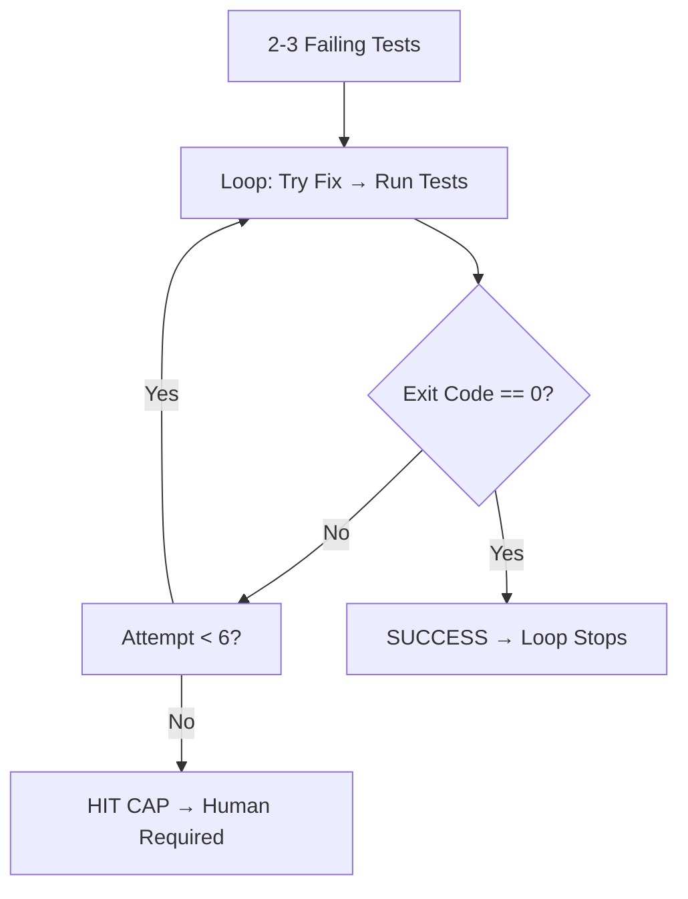

# 🔄 Project 2: The Test-Then-Stop Loop

> **Heartbeat:** Conditional Loop · **Difficulty:** 🟡 Easy–Medium · **Time:** ~30 min
> **Pattern:** Maker-Checker (the loop is the Maker; the test runner is the Checker)

---

## 🎬 The Scene

You have failing tests. You *could* keep prompting "fix it, run tests, fix it, run tests." Or... you build a loop that **keeps working until the test runner says PASS** — and the test runner, not the model, decides when it's done.

**This is the "loop until green" pattern.** The stop signal comes from the world (exit code 0), never from the agent's opinion.

---

## 🧠 What You'll Build



| Component | Role |
|-----------|------|
| **Tests** | The *Checker* — source of truth |
| **Loop** | The *Maker* — keeps iterating |
| **Cap (6 tries)** | Safety net — prevents infinite spin |

---

## 🚀 Quick Start

```bash
mkdir /tmp/test-then-stop && cd /tmp/test-then-stop && git init
claude
```

> **Inside Claude:**
```
Create 2-3 small failing tests in this repo.
Then build a loop that keeps working until the tests pass.
Let the TEST RUNNER decide when it's done (exit code 0).
Cap it at 6 tries.
```

---

## ✅ Definition of Done

| ✓ | Requirement | The Test |
|---|-------------|----------|
| | Stops because tests **actually passed** | Exit code 0, not cap hit |
| | Cap is a safety net, not the goal | If cap hit → your stop condition is broken |
| | Loop doesn't self-declare victory | Only `npm test` / `pytest` says PASS |

---

## 💡 The Lesson You'll Take Away

> **The world decides. Not the model.**
>
> A conditional loop's stop condition must be *external* — a command's exit code, a file's content, an API response. If the agent decides "I'm done," it's not a loop; it's a wish.
>
> **If you keep hitting the cap:** your stop condition is vague, or your prompt doesn't actually drive toward the condition. Fix the prompt, not the cap.

---

## 🧪 Try Breaking It

| Sabotage | What You'll Learn |
|----------|-------------------|
| Make tests impossible to pass | Loop hits cap → you see the safety net work |
| Use a flaky test | Loop stops on false green → you realize *checker quality matters* |
| Remove the cap | Infinite loop → you appreciate the guard |

---

## 🔗 What's Next?

→ [Project 3: The Morning Brief](../03_Project_the_morning_brief_with_a_memory/) — where the loop runs **on a schedule** and **remembers** what it did yesterday.