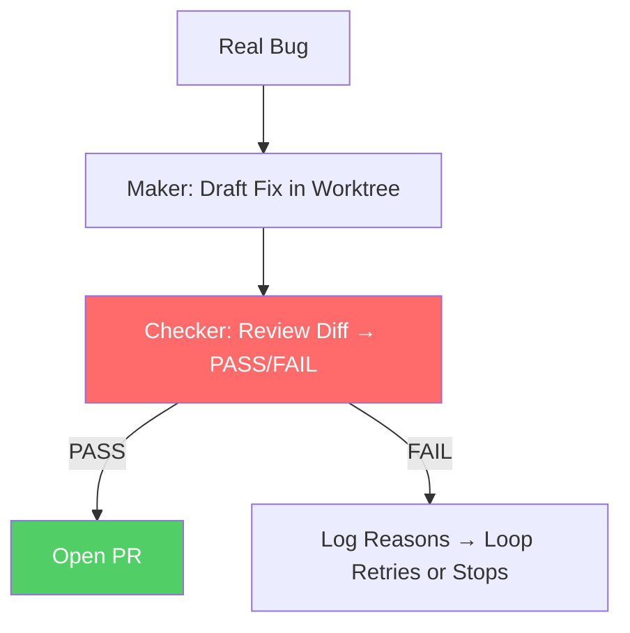

# ✅ Project 4: A Fix with a Real Checker

> **Heartbeat:** Maker-Checker · **Difficulty:** 🟠 Medium–Hard · **Time:** ~60 min
> **Concepts:** Worktree isolation · Skills as contracts · Reviewer with teeth

---

## 🎬 The Scene

You have a bug. You *could* ask Claude to fix it and hope for the best. Or... you build a **maker-checker loop**: one agent drafts the fix in an isolated worktree, a *different* agent reviews it, and **only a `PASS` opens a PR**.

**This is the "trust but verify" pattern — automated.** The checker isn't a rubber stamp; it *fails* bad fixes.

---

## 🧠 What You'll Build



| Component | Role | Key Detail |
|-----------|------|------------|
| **Skill** | Fix procedure as a contract | Reusable, versioned |
| **Worktree** | Isolated checkout | No pollution of main |
| **Reviewer Agent** | The Checker | Replies `PASS` or `FAIL` with reasons |
| **PR Gate** | Only on `PASS` | Human still merges |

---

## 🚀 Quick Start

```bash
mkdir /tmp/fix-with-checker && cd /tmp/fix-with-checker && git init
claude
```

> **Inside Claude:**
```
1. Write a skill with your fix steps
2. Create a reviewer agent that replies PASS or FAIL
3. Take one REAL bug. Have the maker draft a fix in a worktree.
4. Let the reviewer grade it. Open PR ONLY on PASS.
5. Plant a deliberate bad fix. Verify it gets FAIL with reasons.
```

---

## ✅ Definition of Done

| ✓ | Requirement | The Test |
|---|-------------|----------|
| | Good fix → `PASS` + PR | PR opens, diff looks correct |
| | **Bad fix → `FAIL` + reasons** | Checker catches your planted bug |
| | Checker has teeth | If it passes the bad fix → tighten the reviewer |

> **The acid test:** plant an off-by-one, a missing null check, a SQL injection. The checker must flag it.

---

## 💡 The Lesson You'll Take Away

> **A checker that approves everything is no checker.**
>
> The reviewer *must* fail bad fixes. If it doesn't, your reviewer prompt is too soft — tighten it until it draws blood on the planted bugs.
>
> **Worktree isolation matters:** the maker's messy attempts never touch `main`. Only the checker's `PASS` promotes.

---

## 🧪 Try Breaking It

| Sabotage | What You'll Learn |
|----------|-------------------|
| Reviewer prompt: "be encouraging" | Everything passes → checker is useless |
| Skip worktree (commit to main) | Broken code pollutes history → isolation isn't optional |
| Vague skill ("fix the bug") | Maker wanders → skills need specificity |

---

## 🔗 What's Next?

→ [Project 5: Codify the Body](../05_Project_codify_the_body/) — where you turn this loop into a **single reusable command**.