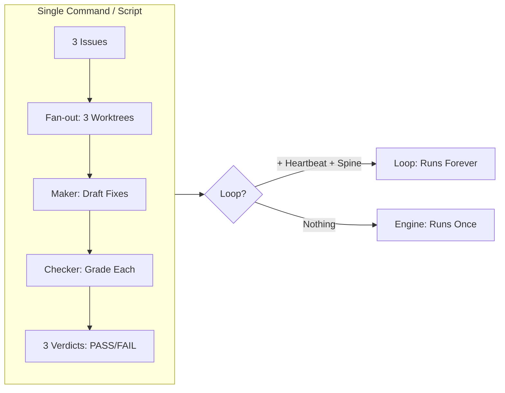

# 📦 Project 5: Codify the Body

> **Concept:** Engine vs Loop · **Difficulty:** 🟠 Medium–Hard · **Time:** ~60 min
> **Builds on:** Project 4 (Fix with Checker)

---

## 🎬 The Scene

You built a maker-checker loop in Project 4. Now **codify its body** — turn the step-by-step prompting into a **single reusable engine** that runs the whole draft-and-review cycle with one command.

**This is the "engine vs loop" distinction.** An engine runs once statelessly. A loop adds a heartbeat + spine to run forever.

---

## 🧠 What You'll Build



| Approach | What You Write |
|----------|----------------|
| **Claude Code** | `/workflows` script: "draft fixes for 3 issues in parallel worktrees, reviewer grades each" → save as `/command` |
| **OpenCode** | Shell script: `for` loop + `&`/`wait` fan-out + reviewer exit codes |

---

## 🚀 Quick Start

```bash
mkdir /tmp/codify-body && cd /tmp/codify-body && git init
claude
```

> **Inside Claude (Claude Code approach):**
```
Use a workflow to draft fixes for these three issues in parallel worktrees, 
and have a reviewer grade each one. Save it as a command when it works.
```

> **Inside terminal (OpenCode approach):**
```
# Write run-candidates.sh that fans out 3 worktrees, runs maker+checker, collects verdicts
./run-candidates.sh
./run-candidates.sh  # Run twice to prove statelessness
```

---

## ✅ Definition of Done

| ✓ | Requirement | The Test |
|---|-------------|----------|
| | **One command runs the whole body** | 3 candidates → 3 isolated checkouts → 3 verdicts, no prompting |
| | **Prove statelessness** | Fresh session/shell → workflow remembers nothing from last run |
| | **Name the missing pieces** | What turns engine → loop? **Heartbeat + Spine** |

> If you can name those two things, you understand the difference.

---

## 💡 The Lesson You'll Take Away

> **An engine is stateless. A loop is stateful.**
>
> - **Engine:** `./run.sh` → does work → exits → forgets everything
> - **Loop:** `./run.sh` + **heartbeat** (cron/event) + **spine** (`progress.md`) → continues
>
> **Dynamic workflows are a research preview** — where this project and live docs disagree, the docs win.

---

## 🧪 Try Breaking It

| Sabotage | What You'll Learn |
|----------|-------------------|
| Run workflow twice without spine | Second run = first run → no memory |
| Remove worktree isolation | Candidates pollute each other → isolation isn't optional |
| Skip the "run twice" test | You assume it works → but engines don't remember |

---

## 🔗 What's Next?

→ [Project 6: The Doorbell Loop](../06_Project_the_doorbell_loop/) — where the loop wakes up on **events** (PR opened, push, issue) not time.