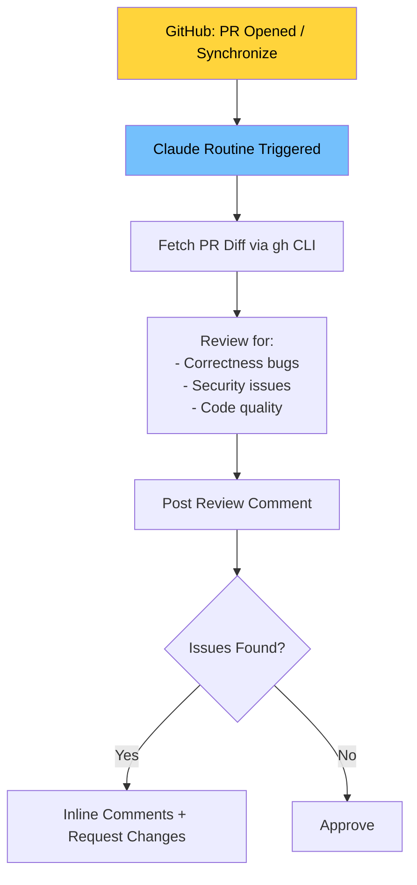

# 🔔 Project 6: The Doorbell Loop

> **Heartbeat:** Event-Driven · **Difficulty:** 🟡 Medium · **Time:** ~45 min
> **Concepts:** Webhook triggers · Connectors · GitHub App integration

---

## 🎬 The Scene

A PR opens. **Instantly**, a review appears — flagging the off-by-one bug you planted. You didn't ask for it. The loop *heard the doorbell* and answered.

**This is the event-driven heartbeat.** No schedule. No polling. The world pokes you; you respond.

---

## 🧠 What You'll Build



| Component | Role |
|-----------|------|
| **GitHub App** | Installed on repo → receives webhooks |
| **Routine** | Trigger: `pull_request.opened`, `pull_request.synchronize` |
| **Prompt** | Review checklist (correctness, security, quality) |
| **Connector** | `gh` CLI to post review |

---

## 🚀 Quick Start

```bash
mkdir /tmp/doorbell-loop && cd /tmp/doorbell-loop && git init
# Push to GitHub (required for webhooks)
git remote add origin https://github.com/YOU/doorbell-loop.git
git push -u origin main
claude
```

> **Setup (one-time):**
> 1. Install [Claude GitHub App](https://github.com/apps/claude) on this repo
> 2. Create Routine at https://claude.ai/code/routines:
>    - **Trigger:** GitHub event → `pull_request.opened` + `pull_request.synchronize`
>    - **Repository:** This repo
>    - **Prompt:** (see below)

> **Routine Prompt:**
```
Review the pull request that triggered this routine.
1. Fetch PR details and diff using gh CLI
2. Analyze for: correctness bugs, security issues, code quality
3. Post summary review comment
4. Leave inline comments on specific lines
5. Approve if clean, request changes if issues found
```

---

## ✅ Definition of Done

| ✓ | Requirement | The Test |
|---|-------------|----------|
| | PR gets **automated review** | No manual trigger — webhook fires |
| | Review **flags planted bug** | Off-by-one / missing null check caught |
| | **Push → re-review** | `synchronize` event fires second review |

---

## 💡 The Lesson You'll Take Away

> **Events are the fourth heartbeat — and the only one that reacts to the outside world.**
>
> | Heartbeat | Trigger | Latency |
> |-----------|---------|---------|
> | In-Session | Timer | ~1 min |
> | Conditional | Exit code | Immediate |
> | Scheduled | Cron | Minutes/hours |
> | **Event-Driven** | **Webhook** | **Seconds** |
>
> With Projects 1–3, you now have **all four heartbeats**.

---

## 🧪 Try Breaking It

| Sabotage | What You'll Learn |
|----------|-------------------|
| Don't install GitHub App | Routine never fires → connector is required |
| Vague prompt ("review the PR") | Generic "looks good" → specificity matters |
| Plant subtle bug (race condition) | Reviewer misses it → you need better checklists |

---

## 🔗 What's Next?

→ [Project 7: Back It to Purpose](../07_Project_back_it_to_purpose/) — where you **measure cost** and **rehearse failure** on your Project 3 loop.