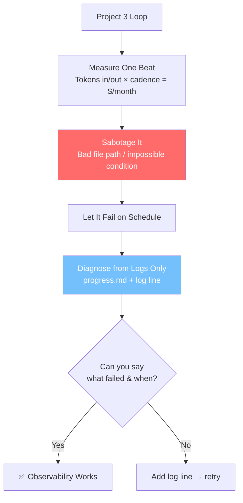

# 💰 Project 7: Back It to Purpose

> **Concepts:** Observability · Cost (Concept 13) · Failure Rehearsal (Concept 14) · **Difficulty:** 🟡 Medium · **Time:** ~60 min
> **Builds on:** Project 3 (Morning Brief)

---

## 🎬 The Scene

Your loop runs daily. But do you know **what it costs**? And when it fails at 3 AM, can you diagnose it **from the logs alone** — without re-running?

**This project forces you to quantify and rehearse failure.** You'll measure monthly cost, sabotage the loop, and prove you can read the autopsy.

---

## 🧠 What You'll Build



| Metric | How to Get It |
|--------|---------------|
| **Tokens/beat** | Check Claude usage after one run |
| **Monthly cost** | Tokens × beats/month × $/token |
| **Failure signal** | "needs a human" note in `progress.md` |

---

## 🚀 Quick Start

```bash
mkdir /tmp/back-to-purpose && cd /tmp/back-to-purpose && git init
# Copy your Project 3 loop here first
claude
```

> **Inside Claude:**
```
1. Run your Project 3 loop once. Note tokens used.
2. Calculate monthly cost at current cadence.
3. Sabotage: point prompt at non-existent file OR impossible condition with limit.
4. Let it fire and fail on schedule.
5. Diagnose using ONLY progress.md and log line — no replay.
```

---

## ✅ Definition of Done

| ✓ | Requirement | The Proof |
|---|-------------|-----------|
| | **Monthly cost known** | You can state: "~$X/month at daily cadence" |
| | **Failure diagnosed from logs** | "Failed Tuesday 3 AM: read missing file X" |
| | **"Needs human" note exists** | `progress.md` has explicit escalation entry |

> **If it failed silently:** fix that FIRST — add the log line. Silent failure is the enemy.

---

## 💡 The Lesson You'll Take Away

> **Observability isn't optional — it's the difference between "it broke" and "I know exactly why and when."**
>
> - **Cost awareness** prevents surprise bills
> - **Failure rehearsal** (while you're watching) prepares you for 3 AM
> - **The spine (`progress.md`)** is your black box — write to it like your job depends on it

---

## 🧪 Try Breaking It

| Sabotage | What You'll Learn |
|----------|-------------------|
| Impossible success condition + no limit | Infinite loop → you need BOTH condition AND cap |
| Corrupt `progress.md` mid-run | Loop crashes → spine needs validation |
| Remove all logging | Silent failure → you can't diagnose |

---

## 🔗 What's Next?

→ [Project 8: Your Daily Loop](../08_Project_your_daily_loop/) — the **capstone** combining all six parts into a production dependency audit.