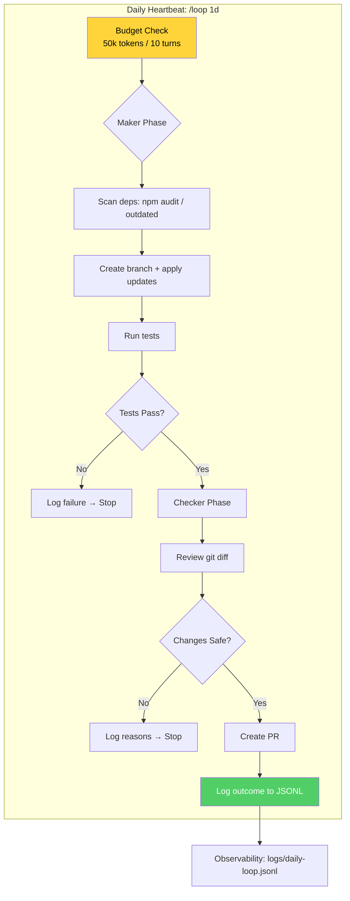

# 🏆 Project 8: Your Daily Loop — Capstone

> **Difficulty:** 🔴 Capstone · **Time:** ~2 hrs
> **Uses:** All six parts — Heartbeats, Maker-Checker, Worktree, Skills, Observability, Connectors

---

## 🎬 The Scene

One loop to rule them all. A **production-ready daily dependency audit** that:
- Runs on a schedule 💓
- Guards budget 🛡️
- Uses maker-checker ✅
- Logs everything 📊
- Isolates in worktrees 📦
- Integrates with GitHub 🔗

**This is your graduation project.** Build it, run it for a week, and *trust it*.

---

## 🧠 What You'll Build



| File | Purpose |
|------|---------|
| `CLAUDE.md` | Project context for the loop |
| `.claude/skills/daily-loop.md` | Skill definition |
| `logs/daily-loop.jsonl` | **Observability log** (one line per run) |
| `package.json` | Dependencies to audit |

### Observability Log Format

```json
{
  "timestamp": "2026-08-18T17:00:00Z",
  "run_id": "run_20260818",
  "tokens_used": 12345,
  "turns_used": 5,
  "outcome": "success|escalated|no_changes",
  "changes_made": ["updated lodash to 4.17.21"],
  "pr_url": "https://github.com/..."
}
```

---

## 🚀 Quick Start

```bash
mkdir /tmp/daily-loop && cd /tmp/daily-loop && git init
# Add a package.json with deps to audit
claude
```

> **Inside Claude:**
```
1. Copy daily-loop-skill.md to .claude/skills/
2. Start the daily loop: /loop 1d /daily-loop
3. Monitor logs/daily-loop.jsonl for outcomes
```

---

## ✅ Definition of Done

| ✓ | Requirement | The Test |
|---|-------------|----------|
| | **Runs unattended for a week** | 7 log entries in `daily-loop.jsonl` |
| | **You trust what it ships** | You read logs, not code — logs tell the story |
| | **Budget guards work** | Escalation logged if tokens/turns exceeded |
| | **Maker-checker catches bad changes** | Plant a bad update → checker rejects it |
| | **Observability = audit trail** | JSONL has timestamp, tokens, outcome, PR URL |

---

## 💡 The Lesson You'll Take Away

> **Trust is earned through observability, not hope.**
>
> After a week, ask honestly:
> > **Did my understanding of the project keep up with what the loop changed?**
>
> If not → **slow the loop down** until it does. When it fails overnight (and it will), work through "When an unattended loop fails" before blaming the model.

---

## 🧪 Try Breaking It

| Sabotage | What You'll Learn |
|----------|-------------------|
| Remove budget guard | Runaway loop → $$$ → guards aren't optional |
| Weaken checker prompt | Bad PR opens → checker quality = loop quality |
| Skip observability | "It worked... I think" → you're flying blind |

---

## 🔗 What's Next?

→ [Project 9: Rehearse a Routine](../09_Project_reharease_a_routine_daily/) — Appendix A: one-off runs and reading transcripts.