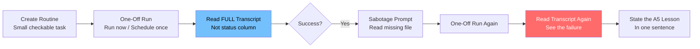

# 🧪 Project 9: Rehearse a Routine

> **Appendix A** · **Difficulty:** 🟢 Easy · **Time:** ~20 min
> **Concepts:** A1 (Routines), A3 (One-Off Schedules), A5 (Reading Runs)

---

## 🎬 The Scene

Before you trust a repeating schedule, **prove you can read what actually happened.** A green status badge lies — it only means "no infrastructure error." The transcript tells the truth.

**This project uses a one-off run to distinguish success from failure by transcript, not status.**

---

## 🧠 What You'll Build



| Step | Action | Key Insight |
|------|--------|-------------|
| 1 | Routine: summarize yesterday's commits → `claude/summary` branch | Small, verifiable |
| 2 | One-off run → **read transcript** | Not the green badge |
| 3 | Break it (read missing file) | Force a real failure |
| 4 | One-off run → **read transcript** | Failure visible in transcript |
| 5 | **One sentence:** why status couldn't tell them apart | **A5 Lesson** |

---

## 🚀 Quick Start

```bash
mkdir /tmp/rehearse-routine && cd /tmp/rehearse-routine && git init
git remote add origin https://github.com/YOU/rehearse-routine.git
git push -u origin main
claude
```

> **Inside Claude:**
```
1. Create a routine that summarizes yesterday's commits onto a claude/summary branch
2. Fire it one-off (Run now) — read the FULL transcript
3. Change prompt to read a file that doesn't exist — fire again
4. Read transcript again — state in ONE SENTENCE why status column couldn't tell them apart
```

---

## ✅ Definition of Done

| ✓ | Requirement | The Test |
|---|-------------|----------|
| | **Two green runs** | One success transcript, one failure transcript |
| | **One-sentence A5 lesson** | "Green = no infra error, not task success" |

> **The lesson:** Green means the session ended without an infrastructure error — nothing more. That sentence IS the A5 lesson.

---

## 💡 The Lesson You'll Take Away

> **Status columns lie. Transcripts don't.**
>
> - ✅ **Green status** = "Claude didn't crash"
> - 📖 **Transcript** = "Here's what actually happened"
>
> Never trust a scheduled routine until you've rehearsed it one-off and read the transcript.

---

## 🧪 Try Breaking It

| Sabotage | What You'll Learn |
|----------|-------------------|
| Only check status column | Both runs look green → you missed the failure |
| Don't read full transcript | You see "success" but not the actual output |
| Use a flaky task | Intermittent failure → transcript shows the pattern |

---

## 🔗 What's Next?

→ [Project 10: Secret Drill](../10_Project_secret_drill/) — Secret delivery: local `.env` vs cloud runner secrets.