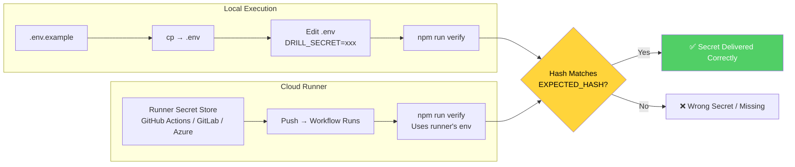

# 🔐 Project 10: Secret Drill

> **Type:** Hands-on Drill · **Difficulty:** 🟢 Hands-on · **Time:** ~30 min
> **Concept:** Secret delivery — local vs cloud runner (never printed, never committed)

---

## 🎬 The Scene

Two environments. One secret. **Never printed. Never committed.** Both paths verified programmatically.

**This drill proves your secret plumbing works** — locally (`.env`) and in CI (GitHub Actions secrets, GitLab variables, etc.).

---

## 🧠 What You'll Build



| File | Purpose | Committed? |
|------|---------|------------|
| `.env` | **Local secret** (gitignored) | ❌ Never |
| `.env.example` | Template | ✅ Yes |
| `verify.mjs` | Reads `process.env.DRILL_SECRET`, hashes, compares to `EXPECTED_HASH` | ✅ Yes |
| `package.json` | `npm run verify` | ✅ Yes |
| `.github/workflows/verify.yml` | CI workflow | ✅ Yes |

---

## 🚀 Quick Start

```bash
mkdir /tmp/secret-drill && cd /tmp/secret-drill && git init
claude
```

> **Inside Claude:**
```
Set up the secret drill:
1. Create .env.example template
2. Create verify.mjs that hashes DRILL_SECRET and compares to EXPECTED_HASH
3. Create package.json with npm run verify
4. Create .github/workflows/verify.yml for CI
5. Generate EXPECTED_HASH for your chosen secret
```

### Local Verification

```bash
cp .env.example .env
# Edit .env → DRILL_SECRET=your_actual_secret
npm run verify
```

### Cloud Verification

1. Add `DRILL_SECRET` to runner's secret store (GitHub: Settings → Secrets → Actions)
2. Push → workflow runs automatically

### Generate Expected Hash

```bash
node -e "console.log(require('crypto').createHash('sha256').update('YOUR_SECRET_VALUE').digest('hex'))"
# Paste output into verify.mjs as EXPECTED_HASH
```

---

## ✅ Definition of Done

| ✓ | Requirement | The Test |
|---|-------------|----------|
| | **Local verification passes** | `npm run verify` → ✅ |
| | **Cloud verification passes** | CI workflow green → ✅ |
| | **Secret never printed** | No secret in logs, output, or repo |
| | **Hash comparison works** | Wrong secret → ❌ |

---

## 💡 The Lesson You'll Take Away

> **Secrets have two delivery paths — both must work, both must be verified, neither exposes the value.**
>
> - **Local:** `.env` (gitignored) → `process.env`
> - **Cloud:** Runner secret store → `process.env`
> - **Verification:** Hash comparison against committed `EXPECTED_HASH`
>
> The secret value itself is **never printed, never committed, never logged.**

---

## 🧪 Try Breaking It

| Sabotage | What You'll Learn |
|----------|-------------------|
| Commit `.env` with real secret | Git history leak → `.gitignore` is mandatory |
| Wrong `EXPECTED_HASH` | Verification fails → hash must match exactly |
| Forget to add secret to CI | Workflow fails → cloud path needs explicit config |

---

## 🔗 What's Next?

→ [Project 11: Build a Two-Routine Gate](../11_Project_build_two_routine_gate/) — Human gate: Routine A drafts, Routine B approves via API trigger.