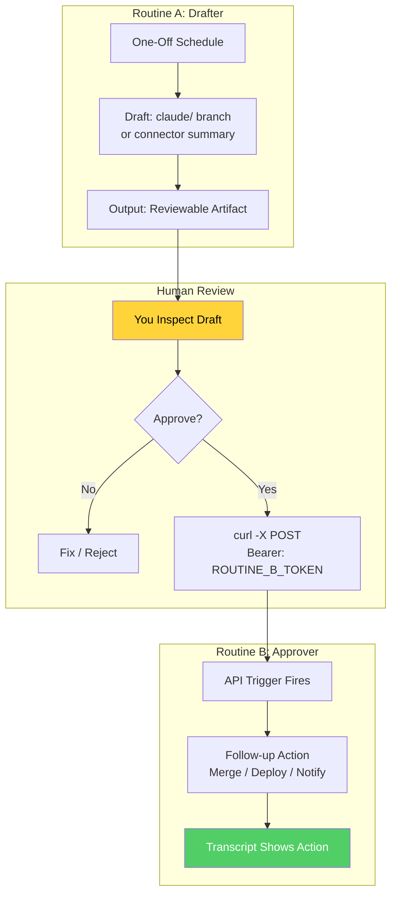

# 🚪 Project 11: Build a Two-Routine Gate

> **Appendix A** · **Difficulty:** 🟠 Medium–Hard · **Time:** ~60 min
> **Concepts:** A3 (API Trigger), A4 (The Gate), A6 (The Checklist)

---

## 🎬 The Scene

**Human-in-the-loop, automated.** Routine A drafts. You review. You fire Routine B via API to approve. The gate only opens when *you* say so.

**This is the human gate from Part 5 — built from real parts.**

---

## 🧠 What You'll Build



| Routine | Trigger | Action |
|---------|---------|--------|
| **A** | One-off schedule | Draft something reviewable |
| **B** | **API trigger** (you curl it) | One small follow-up action |

**Critical:** Routine B's bearer token is shown **once** — capture it immediately into `.env` (gitignored).

---

## 🚀 Quick Start

```bash
mkdir /tmp/two-routine-gate && cd /tmp/two-routine-gate && git init
git remote add origin https://github.com/YOU/two-routine-gate.git
git push -u origin main
claude
```

> **Inside Claude:**
```
1. Create Routine A (one-off schedule): draft a claude/ branch or summary
2. Create Routine B (API trigger): small follow-up action
3. CAPTURE B's bearer token IMMEDIATELY — shown once!
4. Review A's draft yourself
5. Approve by firing B: curl -X POST <B_URL> -H "Authorization: Bearer <TOKEN>"
```

---

## ✅ Definition of Done

| ✓ | Requirement | The Test |
|---|-------------|----------|
| | **B ran only because you fired it** | No auto-trigger — your curl started it |
| | **B's transcript shows action happened** | Follow-up action visible in Routine B logs |
| | **A6 checklist passed** | Connectors pruned, unrestricted pushes off, state file chosen |

---

## 💡 The Lesson You'll Take Away

> **The human gate isn't a metaphor — it's two routines + one curl.**
>
> - Routine A = "Here's my proposal"
> - Human = "I approve" (or not)
> - Routine B = "Done" (only fires on your signal)
>
> **Security:** Bearer token shown once → store in `.env` (gitignored). Unrestricted pushes OFF. Connectors pruned. State file chosen.

---

## 🧪 Try Breaking It

| Sabotage | What You'll Learn |
|----------|-------------------|
| Lose bearer token | Can't fire B → token capture is critical |
| Skip A6 checklist | Over-permissioned routines → security hole |
| Auto-trigger B | Defeats the gate → human approval is the point |

---

## 🔗 What's Next?

→ [Project 12: Build a Dreamy Loop](../12_Project_build_dreamy_loop/) — **Capstone:** An improvement loop that reads its own logs and proposes rule changes.