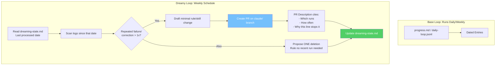

# 🌙 Project 12: Build a Dreamy Loop

> **Capstone** · **Difficulty:** 🔴 Capstone · **Time:** ~2 hrs
> **Concepts:** Concept 12 (Spine + Improvement Loop), Concept 11 (Maker-Checker), Concept 6 (Schedule), Part 5 (Human Gate)

---

## 🎬 The Scene

A loop that **dreams about its own failures** — and proposes fixes.

You have a loop that's run for a week (Project 3 or 8). Now build a **second loop over it**: weekly, it reads the logs, finds repeated failures, and drafts a **PR with the smallest rule change** to prevent them. It also proposes **one deletion** — a rule no recent run needed.

**This is the improvement loop.** It doesn't guess. It cites evidence.

---

## 🧠 What You'll Build



| File | Purpose |
|------|---------|
| `progress.md` / `daily-loop.jsonl` | Base loop's spine (from Project 3/8) |
| `dreaming-state.md` | **Dreamy loop's spine** — tracks last processed date |
| `claude/` branch PR | Proposed rule change (never direct commit) |

---

## 🚀 Quick Start

```bash
mkdir /tmp/dreamy-loop && cd /tmp/dreamy-loop && git init
# Must have base loop logs from Project 3 or 8
claude
```

> **Inside Claude:**
```
1. Ensure you have a base loop with 7+ days of logs (Project 3 or 8)
2. Build weekly dreamy loop:
   - Reads dreaming-state.md for last processed date
   - Scans base logs since that date
   - Finds repeated failures/corrections
   - Drafts minimal rule/skill change as PR on claude/ branch
   - PR cites evidence: runs, frequency, why this stops it
   - Proposes ONE deletion: unused rule
   - Updates dreaming-state.md
3. Plant a deliberate repeated failure in logs → verify it's caught
```

---

## ✅ Definition of Done

| ✓ | Requirement | The Test |
|---|-------------|----------|
| | **PR traces to real log entries** | Not a guess — cites specific runs, counts |
| | **Planted repeated failure caught** | Add duplicate failure by hand → dreamy loop proposes fix |
| | **No direct commits** | Only PR on `claude/` branch — human merges |
| | **Deletion proposed** | One rule no recent run needed |

> **If the loop proposes changes with no evidence:** tighten the prompt. An improvement loop that guesses is worse than none — its guesses steer every future run.

---

## 💡 The Lesson You'll Take Away

> **The dreamy loop is the loop that improves the loop.**
>
> - **Base loop** does the work
> - **Dreamy loop** watches the base loop's spine
> - **Human gate** (PR review) approves changes
> - **Spine** (`dreaming-state.md`) ensures no double-processing
>
> This is **Concept 12 fully realized**: a spine that enables not just continuity, but *improvement*.

---

## 🧪 Try Breaking It

| Sabotage | What You'll Learn |
|----------|-------------------|
| No `dreaming-state.md` | Re-processes old logs → duplicate PRs |
| Vague prompt ("improve things") | Guesses → steering future runs wrong |
| Skip deletion proposal | Rule bloat → dead rules accumulate |

---

## 🔗 Journey Complete

```
┌────────────────────────────────────────────────────────────┐
│  🎓 YOU'VE BUILT ALL FOUR HEARTBEATS + CAPSTONES          │
├────────────────────────────────────────────────────────────┤
│  01 ▸ In-Session      07 ▸ Cost & Failure Rehearsal       │
│  02 ▸ Conditional     08 ▸ Daily Loop (Capstone)          │
│  03 ▸ Scheduled       09 ▸ One-Off Rehearsal              │
│  04 ▸ Maker-Checker   10 ▸ Secret Delivery                │
│  05 ▸ Engine vs Loop  11 ▸ Human Gate (Two Routines)      │
│  06 ▸ Event-Driven    12 ▸ Dreamy Loop (Capstone)         │
└────────────────────────────────────────────────────────────┘
```

**You now have the full Loop Engineering toolkit.** Go build loops that run while you sleep — and tell you the truth when you wake.