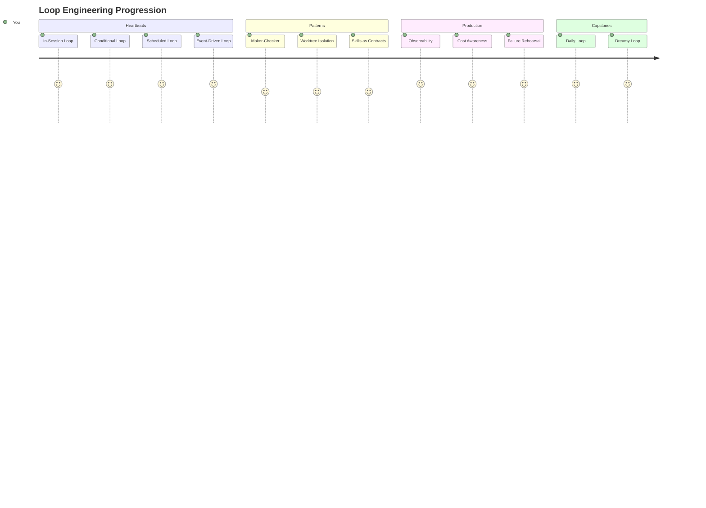

# 🔄 Loop_Engineering

> **Twelve projects. Four heartbeats. One discipline.**
>
> *Build loops that run while you sleep — and tell you the truth when you wake.*

---

## 🎯 What Is This?

**Loop Engineering** is the craft of turning *"Claude, do this"* into *"Claude, keep doing this until it's right — and prove it."*

This repo is a **hands-on curriculum**. Each project teaches one heartbeat (a loop pattern) by making you build a real, working loop that ships code, reviews PRs, audits dependencies, or guards secrets — unattended.

```
┌─────────────────────────────────────────────────────────────────┐
│  📚 LEARN BY BUILDING                                           │
│  ─────────────────                                              │
│  Don't read about loops.  Run them.  Break them.  Fix them.    │
│  The only way to trust an unattended loop is to watch it fail  │
│  — safely — while you're still watching.                        │
└─────────────────────────────────────────────────────────────────┘
```

---

## 🗺️ The Journey



| # | Project | Heartbeat | Difficulty | Time |
|---|---------|-----------|------------|------|
| **01** | [Watcher Loop](01_Project_a_watcher_loop/) | ⏱️ In-Session | 🟢 Easy | ~15 min |
| **02** | [Test-Then-Stop](02_Project_the_test_then_stop/) | 🔄 Conditional | 🟡 Easy–Med | ~30 min |
| **03** | [Morning Brief](03_Project_the_morning_brief_with_a_memory/) | 📅 Scheduled | 🟡 Medium | ~45 min |
| **04** | [Fix with Checker](04_Project_a_fix_with_a_real_checker/) | ✅ Maker-Checker | 🟠 Med–Hard | ~60 min |
| **05** | [Codify the Body](05_Project_codify_the_body/) | 📦 Engine vs Loop | 🟠 Med–Hard | ~60 min |
| **06** | [Doorbell Loop](06_Project_the_doorbell_loop/) | 🔔 Event-Driven | 🟡 Medium | ~45 min |
| **07** | [Back It to Purpose](07_Project_back_it_to_purpose/) | 💰 Cost & Failure | 🟡 Medium | ~60 min |
| **08** | [Your Daily Loop](08_Project_your_daily_loop/) | 🏆 **Capstone** | 🔴 Capstone | ~2 hrs |
| **09** | [Rehearse a Routine](09_Project_reharease_a_routine_daily/) | 🧪 One-Off Runs | 🟢 Easy | ~20 min |
| **10** | [Secret Drill](10_Project_secret_drill/) | 🔐 Secret Delivery | 🟢 Hands-on | ~30 min |
| **11** | [Two-Routine Gate](11_Project_build_two_routine_gate/) | 🚪 Human Gate | 🟠 Med–Hard | ~60 min |
| **12** | [Dreamy Loop](12_Project_build_dreamy_loop/) | 🌙 **Capstone** | 🔴 Capstone | ~2 hrs |

---

## 🚦 Quick Start

```bash
# 1. Clone (or fork) this repo
git clone https://github.com/your-org/Loop_Engineering.git
cd Loop_Engineering

# 2. Pick a project — start at 01
cd 01_Project_a_watcher_loop

# 3. Read its README.md — that's your spec
# 4. Create a THROWAWAY git repo for the exercise
mkdir /tmp/loop-practice-01 && cd /tmp/loop-practice-01
git init

# 5. Open Claude Code and begin
claude
```

> ⚠️ **Golden Rule:** Every project expects a **throwaway repository**. The loops create, delete, and modify files autonomously. Never run them in a repo you care about.

---

## 🧠 The Mental Model

```
┌────────────────────────────────────────────────────────────┐
│                    A LOOP IS NOT A SCRIPT                   │
├────────────────────────────────────────────────────────────┤
│  Script:  runs once, exits, remembers nothing              │
│  Loop:    runs forever, persists state, survives failure   │
│                                                             │
│  The difference?  Three things:                             │
│  1. 💓 A HEARTBEAT      — what triggers the next beat      │
│  2. 🦴 A SPINE          — progress.md, the memory across   │
│                           beats                             │
│  3. 🛡️ A GUARD          — budget, checker, observability   │
└────────────────────────────────────────────────────────────┘
```

| Heartbeat | Trigger | Survives Session Close? | Use When... |
|-----------|---------|------------------------|-------------|
| **In-Session** | `/loop` timer | ❌ No | Quick feedback while you're there |
| **Conditional** | Exit code / file state | ❌ No | "Keep going until X passes" |
| **Scheduled** | Cron / Routine | ✅ Yes | Daily/weekly maintenance |
| **Event-Driven** | Webhook (PR, push, issue) | ✅ Yes | React to external changes |

---

## ✅ How to Know You're Done

Each project has a **Definition of Done** — a checklist. Don't just tick boxes. The loop must *actually* satisfy the condition.

```markdown
- [ ] The loop stops because tests passed (not because it hit the cap)
- [ ] Second run builds on the first (spine works)
- [ ] Bad fix gets FAIL with reasons (checker has teeth)
- [ ] You can diagnose failure from logs alone (observability)
- [ ] Monthly cost calculated and logged (cost awareness)
```

> **Pro tip:** If a project feels too easy, you're probably skipping the "prove it" step. The lesson lives in the verification.

---

## 🎓 Conventions Used Here

| Symbol | Meaning |
|--------|---------|
| 🟢 🟡 🟠 🔴 | Difficulty: Easy → Easy-Med → Med-Hard → Capstone |
| 💓 | Heartbeat / Trigger type |
| 🦴 | Spine / Persistent state file |
| 🛡️ | Guard / Safety mechanism |
| 📦 | Engine (stateless) vs Loop (stateful) |
| ⚠️ | "Don't skip this" warning |
| 💡 | Key insight / mental model |

---

## 🤝 Contributing

Found a bug in a project spec? Want to add a new heartbeat? PRs welcome — but **test your loop first**. A project without a verified Definition of Done is just documentation.

---

## 📜 License

MIT — use it, fork it, teach with it, build on it.

---

<div align="center">

**Ready?** → [Start with Project 01 →](01_Project_a_watcher_loop/)

*Your first loop is waiting.*

</div>